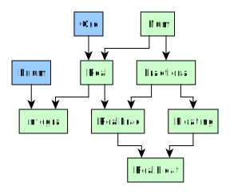

# Gotchas

## Prelude is Unsafe

AFAICT, Haskell's default Prelude has at least the following issues:
- it includes `Partial` functions (e.g. [here's a (potentially non-exhaustive) list of such functions](https://github.com/strake/rfcs/blob/ceae95ab61def026bff950d5edf42ed2cfad01b7/texts/0000-scrub-partial-functions-from-prelude.rst#summary)). Since there isn't a `Partial` type class to indicate these, one must know which functions to avoid.
- most of its text-related functions use `List Char` (i.e. `String` in Haskell), not `Text` (i.e. what most programmers think of when we say `String`).
- a number of common data types and functions aren't included. These must be obtained via libraries outside of Prelude, such as:
    - [vector](https://hackage.haskell.org/package/vector) to get PureScript-like `Array`s
    - [text](https://hackage.haskell.org/package/text) to get PureScript-like `String`s
    - [deepseq](https://hackage.haskell.org/package/deepseq) to get functions that can make things strict
    - [unordered-containers](https://hackage.haskell.org/package/unordered-containers) to get hashing-based containers (e.g. `HashMap`s, `Set`s, etc.).

As a result, [many have attempted to define an alternative Prelude]((https://guide.aelve.com/haskell/alternative-preludes-zr69k1hc)) that deals with some of these issues. Unfortunately, I'm not sure whether using such alternatives is ultimately worth it.

## Handling Exceptions - Synchronous and Asynchronous

- https://tech.fpcomplete.com/haskell/tutorial/exceptions
- https://markkarpov.com/tutorial/exceptions.html

## Numeric Hierarchy

The numeric type class hierarchy work differently in PureScript than it does in Haskell. Thus, some have come up with the [numeric-prelude](https://hackage.haskell.org/package/numeric-prelude-0.1.3.4) to account for some of these shortcomings. Again, I don't know how frequently this library is used, nor what tradeoffs are made by using it.

Read over their docs to get an idea for what functions they define.
- [Num](https://hackage.haskell.org/package/base-4.12.0.0/docs/Prelude.html#t:Num)
- [Real](https://hackage.haskell.org/package/base-4.12.0.0/docs/Prelude.html#t:Real)
- [Integral](https://hackage.haskell.org/package/base-4.12.0.0/docs/Prelude.html#t:Integral)
- [Fractional](https://hackage.haskell.org/package/base-4.12.0.0/docs/Prelude.html#t:Fractional)
- [RealFrac](https://hackage.haskell.org/package/base-4.12.0.0/docs/Prelude.html#t:RealFrac)
- [Floating](https://hackage.haskell.org/package/base-4.12.0.0/docs/Prelude.html#t:Floating)
- [RealFloat](https://hackage.haskell.org/package/base-4.12.0.0/docs/Prelude.html#t:RealFloat)

For a venn-diagram-basd way to visualize it, see [Haskell: Numeric Type Classes - How Numbers Work!](https://gist.github.com/CMCDragonkai/fab0980b3325e8a788c9#file-the_diagram-png)
